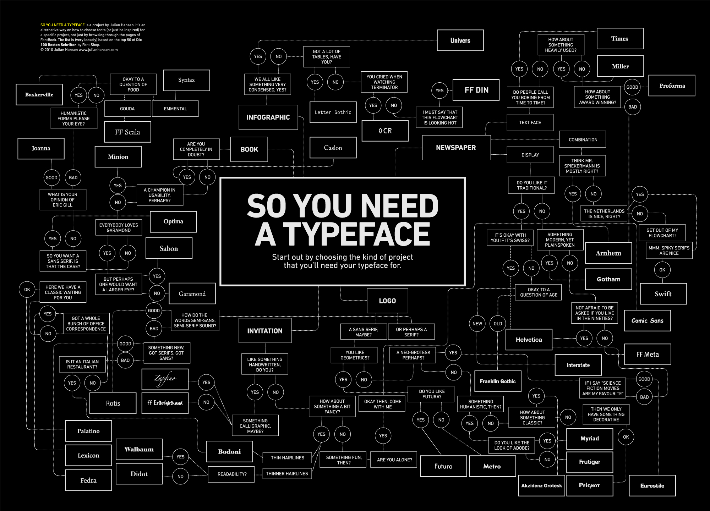
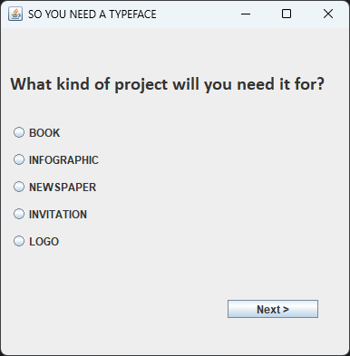
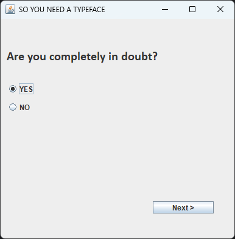
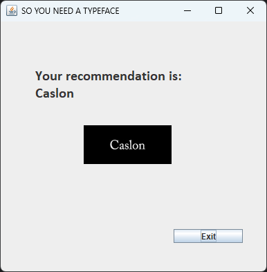

# CLIPS Expert System - Typeface Selector

An expert system project by 156080 and 155805.



# About
- This program uses the CLIPS language to help you choose a typeface to use for a project.
- It gathers facts based on user choices and uses them to match typeface recommendations.
- It is entirely data driven, the Java program itself has no context about the data. The fact and rule base could hypothetically be changed to an entirely different topic and the program would still function.

# Required templates and facts
- The fact and rule base needs to have these templates defined to work:
	```
	(deftemplate question
		(slot text (type STRING))
		(multislot choices (type STRING))
		(multislot facts (type STRING))
		(slot multiple (type INTEGER))
	)

	(deftemplate recommendation
		(slot name (type STRING))
		(slot preview (type STRING))
	)

	(deftemplate program-info
		(slot name (type STRING))
	)
	```
- You also need to define a starting fact for program information and at least one question:
	```
	(deffacts program-setup
		(program-info
			(name "SO YOU NEED A TYPEFACE")
		)
		(question
			(text "What kind of project will you need it for?")
			(choices
				"BOOK" "INFOGRAPHIC" "NEWSPAPER" "INVITATION" "LOGO"
			)
			(facts
				"(project book)" "(project infographic)" "(project newspaper)" "(project invitation)" "(project logo)"
			)
			(multiple 0)
		)
	)
	```

# Build and run instructions
- Get [CLIPSJNI](https://clipsrules.net/CLIPSJNI.html) and put it into the root folder of the project.
- Open the project with a Java IDE of your choice (tested on IntelliJ IDEA 2024.3).
- Configure the JDK (tested on OpenJDK18, 21, 23) and source directories accordingly.
- Run the project - you should see a Swing window pop up.

# Screenshots




# Credits:
- Project: 156080 and 155805
- Flowchart: (2010) Julian Hansen - www.julianhansen.com
- CLIPS: NASA Johnson Space Center
